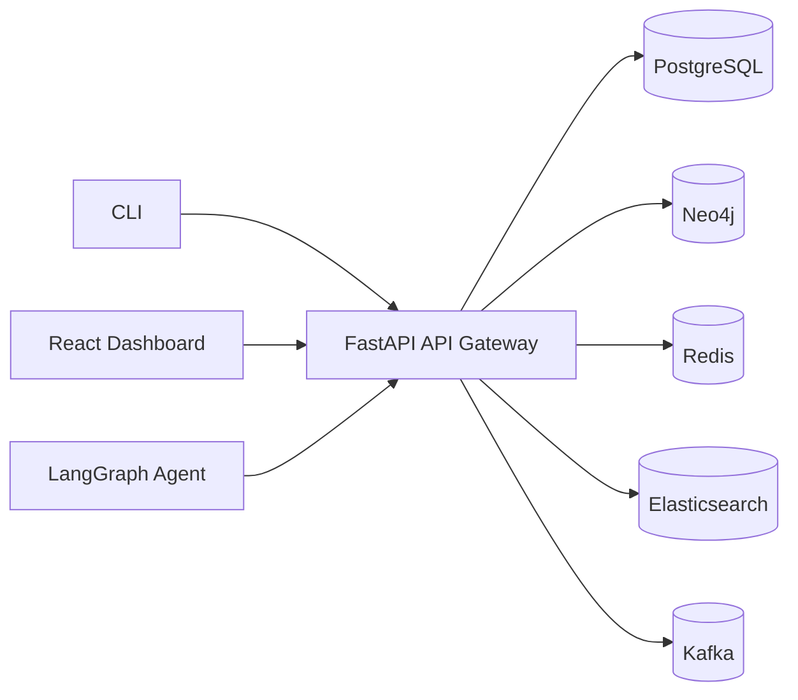

# CyberGuard

CyberGuard is a modular AI-powered cybersecurity agent platform for mission-critical systems.

## Architecture



## Quick start

```bash
docker compose up -d
```

## Modules

- `packages/domain-engine/` — Domain selector + standards mapper
- `integrations/cicd/github-actions/sbom-action/` — reusable SBOM CI action
- `infra/docker/docker-compose.yml` — local runtime stack

## Demo data

Sample SBOM/CVE fixtures are expected under `tests/fixtures/`.
